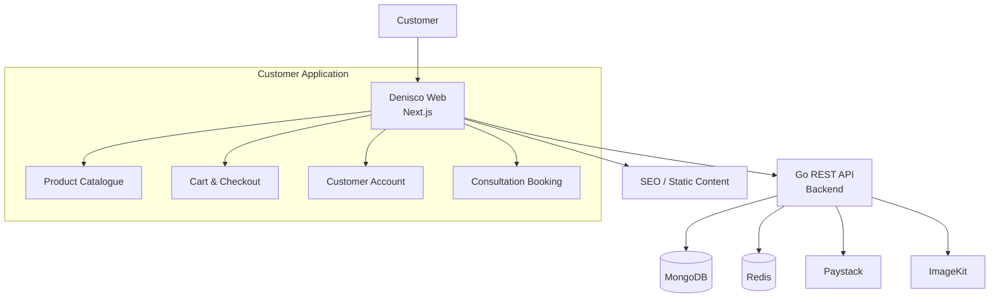

# Denisco Web

Customer-facing web application for **Denisco Global Agriculture Ltd.**

The application provides the public company website, product catalogue, shopping flow, checkout, customer accounts, consultation booking and related customer features.

## Tech Stack

* **Framework:** Next.js
* **Language:** TypeScript
* **Data Fetching:** TanStack Query
* **Forms:** React Hook Form + Zod
* **Styling:** Tailwind CSS
* **UI:** shadcn/ui + Lucide
* **API:** Denisco Go Backend
* **Payments:** Paystack

## Architecture



## Main Features

* Company website and information pages
* Services
* Product catalogue
* Product details
* Shopping cart
* Checkout
* Paystack payment flow
* Customer registration and login
* Customer profile
* Order history and order details
* Payment history
* Consultation booking
* Responsive mobile, tablet and desktop UI

## Project Structure

```text
denisco_web/
├── public/
├── src/
│   ├── app/
│   ├── components/
│   ├── features/
│   ├── hooks/
│   ├── lib/
│   ├── providers/
│   └── types/
├── tests/
├── .env.example
├── next.config.ts
├── package.json
├── tsconfig.json
└── README.md
```

## Getting Started

### Requirements

* Node.js
* npm

### Installation

```bash
git clone <repository-url>
cd denisco_web

npm install
```

Create your environment file:

```bash
cp .env.example .env.local
```

Configure the required environment variables, then start the development server:

```bash
npm run dev
```

The application will be available at:

```text
http://localhost:3000
```

## Backend

The web application communicates directly with the Denisco Go API.

```text
Next.js Web
     │
     │ HTTPS / JSON
     ▼
Go REST API
     │
     ├── MongoDB
     ├── Redis
     ├── Paystack
     └── ImageKit
```

The frontend does not contain business-critical payment, inventory, order or authorization logic. Those rules are enforced by the backend.

## Product & Design Reference

The approved **HTML/CSS/JavaScript prototype** is the canonical reference for:

* Features
* User flows
* UI structure
* Design system
* Colours
* Typography
* Responsive behaviour
* Product and checkout experience

The production Next.js application should reproduce the approved prototype while replacing its local/demo behaviour with the production API.

## Development

```bash
npm run dev
```

Build for production:

```bash
npm run build
```

Start production build:

```bash
npm run start
```

Run linting:

```bash
npm run lint
```

## Testing

Frontend tests should cover:

* Components
* Forms and validation
* Authentication flows
* Cart behaviour
* Checkout states
* API error handling
* Consultation booking
* Responsive-critical interactions

## Environment

Example:

```env
NEXT_PUBLIC_API_URL=
NEXT_PUBLIC_PAYSTACK_PUBLIC_KEY=
NEXT_PUBLIC_IMAGEKIT_URL_ENDPOINT=
```

Production secrets and private credentials must not be committed to the repository.

## Deployment

The application is deployed as an independent Next.js application.

```text
Internet
   │
   ▼
Cloudflare
   │
   ▼
Next.js Web
   │
   ▼
Denisco Go API
```

The web application and backend are maintained and deployed independently.
